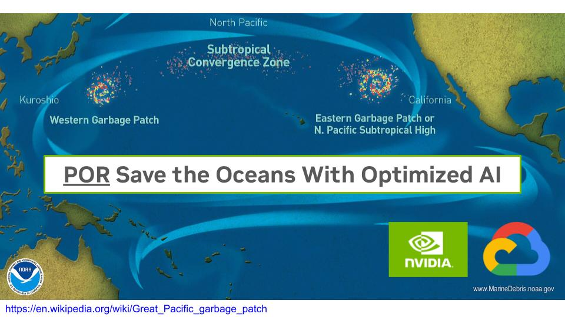

# Saving Dolphins with AI Optimization
https://en.wikipedia.org/wiki/Great_Pacific_garbage_patch

### progress

##### compile / optimize
* [X] TensorFlow --> ONNX
* [X] ONNX --> Nsight DL Designer
* [X] Nsight DL DesignerLD (DLD) --> TensorRT
* [ ] TensorFlow --> ONNX --> TensorRT
  * [EfficientNet V1 NB](https://gist.github.com/nv-will-hill/7c98fc65fd5f2b3482af75647aa4637a)
* [ ] Circularnet --> ONNX
* [ ] Circularnet (TF) --> ONNX --> TensorRT
* [ ] Circularnet (TF) --> ONNX --> (DLD) --> TensorRT

##### deploy
* [X] TensorRT --> Infer
* [ ] TensorRT --> Jetson (sim)
* [ ] TensorRT --> Jetson
* [ ] Jetson --> Infer
* [ ] Jetson --> Infer (LA)

---

##### Table
| task                                                     | status  |
| --------                                                 | ------- |
| TF** --> ONNX                                            |  [X]    |
| ONNX --> DLD***                                          |  [X]    |
| DLD --> TRT****                                          |  [X]    |
| TRT --> Infer                                            |  [X]    |
| TensorFlow --> ONNX --> TensorRT                         |  [ ]    |
| CrcNet*  --> ONNX                                        |  [ ]    |
| TensorFlow --> ONNX --> TensorRT --> Infer               |  [ ]    |
| TRT --> Jetson                                           |  [ ]    |
| Jetson (Sim) --> Infer                                   |  [ ]    |
| Jetson --> Infer                                         |  [ ]    |
| Jetson --> Infer (LA)                                    |  [ ]    |

*CrcNet  
**TensorFlow  
***Nsight DL Designers  
****TensorRT  

* [ ] L_TF_ONNX
* [ ] W_TF_ONNX
* [ ] L_ONNX_TRT
* [ ] W_ONNX_TRT
* [ ] L_TF_ONNX_TRT
* [ ] W_TF_ONNX_TRT
* [ ] L_TRT_JET
* [ ] W_TRT_JET
* [ ] L_TF_ONNX_TRT_JET
* [ ] W_TF_ONNX_TRT_JET      
